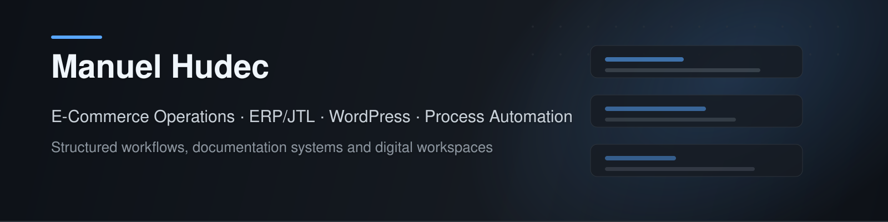

  

## About

I work on structured e-commerce operations, ERP-related processes, product data workflows and documentation systems.

My focus is turning operational knowledge into reusable workflows, standards and workspace structures.

## Focus

- E-Commerce Operations and multi-channel workflows
- JTL-Wawi, JTL-Workflows and JTL-Ameise
- ERP-related process automation
- Product data, variants, attributes and import/export processes
- WordPress, WooCommerce and Blocksy
- GitHub-based documentation and workspace standards

## Current Work

I am currently building reusable structures around:

- workspace and documentation standards
- GitHub-based knowledge and project systems
- an internal Operations Workspace Project for service insights, client workspaces and process optimization

## Links

- Website: [manuel-hudec.de](https://manuel-hudec.de)
- LinkedIn: [manuel-hudec](https://www.linkedin.com/in/manuel-hudec/)
- WordPress: [profiles.wordpress.org/urbnn](https://profiles.wordpress.org/urbnn/)
